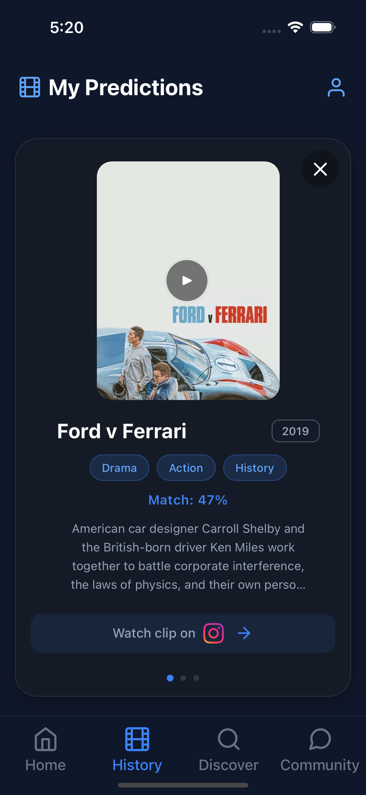
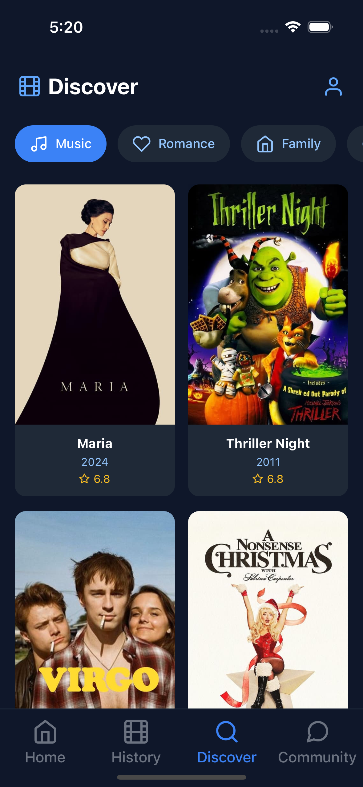

# MovieMind 🎬

<p align="center">
  
</p>

[](https://reactnative.dev/)
[](https://firebase.google.com/)
[](LICENSE)

MovieMind is an innovative mobile application that revolutionizes movie discovery through AI-powered social media content analysis. By analyzing video clips from popular social media platforms, MovieMind helps users identify movies and discover similar content they might enjoy.

## ✨ Features

### 🎯 Smart Movie Prediction
- **Multi-Platform Support**: 
  - Instagram Reels/Posts
  - TikTok Videos
  - Facebook Videos


- **AI-Powered Analysis**: OpenAI Clip + google cloud api for fast and accurate movie matching
- **Multiple Matches**: Get multiple movie suggestions with confidence scores

- **Rich Movie Details**: Access comprehensive movie information 


### 🔍 Discovery Features
- **Genre-based Browsing**: Explore movies across different genres
- **Trending Section**: Stay updated with popular movies
- **Detailed Movie Cards**: 
  - High-quality posters
  - Rating information
  - Release dates
  - Genre tags

### 👤 User Features
- **Secure Authentication**: Email-based signup and login
- **Prediction History**: Access your past movie predictions
- **Community Feed**: View predictions from other users

### 🎨 UI/UX Features
- **Responsive Design**: 
  - Adaptive layouts
  - Dynamic sizing
- **Dark Theme**: Eye-friendly dark mode optimized for movie browsing
- **Smooth Animations**: 
  - Loading states with Lottie animations
  - Smooth transitions
  - Interactive feedback

## 🛠 Technical Architecture

### Frontend Stack
- **Framework**: React Native
- **State Management**: React Context API
- **Navigation**: React Navigation
- **UI Components**: Custom components
- **Icons**: Feather Icons
- **Animations**: Lottie

### Backend Services (Firebase)
- **Authentication**: Firebase Auth
- **Database**: Cloud Firestore
- **Storage**: Firebase Storage
- **Security**: Firebase Security Rules
- **AI**: OpenAI Clip + google cloud api hosted on salad cloud

## 📱 Screenshots

<p align="center">
  
  
  
  
</p>

## 🚀 Getting Started

### Prerequisites
- npm or yarn
- React Native development environment
- Firebase account

### Installation

1. Clone the repository
```bash
git clone https://github.com/safwan188/MovieMind2
cd moviemind
```

2. Install dependencies
```bash
npm install
# or
yarn install
```

3. Configure Firebase
- Create a new Firebase project
- Copy your Firebase configuration to `firebaseConfig.js` file:
```javascript

export const firebaseConfig = {
  apiKey: "your-api-key",
  authDomain: "your-auth-domain",
  projectId: "your-project-id",
  storageBucket: "your-storage-bucket",
  messagingSenderId: "your-messaging-sender-id",
  appId: "your-app-id"
};
```

4. Start the development server
```bash
npm start
# or
yarn start
```

5. Run on your device/simulator
```bash

npx expo start 

```

## 📁 Project Structure

```
moviemind/
├── src/
│   ├── components/          # Reusable UI components
│   │   ├── MovieDetailModal.js
│   │   ├── PredictionSection.js
│   │   └── ...
│   ├── context/            # Context and API
│   │   ├── UserContext.js
│   │   └── API.js
│   ├── navigation/ 
│   │   ├── AppNavigator.js
│   │   └── header.js
│   ├── assets/ 
│   │   ├── new_logo.png
│   │   └── ...
│   └── screens.js            #app screens
│
│
├── assets/                # App assets
├── android/               # Android specific files
├── ios/                   # iOS specific files
└── package.json
```


## 🐛 Known Issues

- [Issue 1]: predictor dataset support 1500 movies because of computational power limitations

## 📄 License

This project is licensed under the MIT License - see the [LICENSE](LICENSE) file for details.

## 👏 Acknowledgments

- [Firebase](https://firebase.google.com/) - Backend services
- [TMDB](https://www.themoviedb.org/) - Movie database
- [React Native Community](https://reactnative.dev/community/overview) - Tools and support
- [Lottie](https://airbnb.design/lottie/) - Beautiful animations


<p align="center">
  Made with ❤️ by Safwan
</p>
